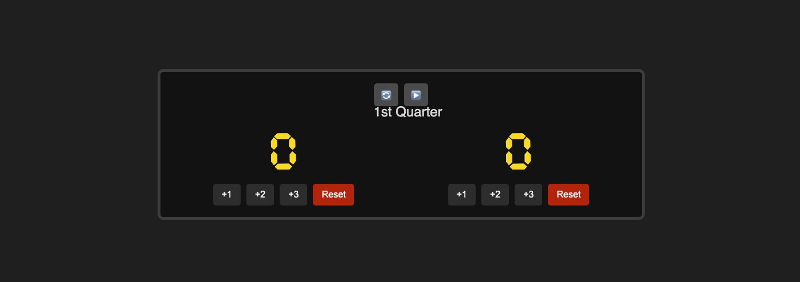

# Interactive Basketball Scoreboard (HTML, CSS, & JavaScript)

This project provides an interactive basketball scoreboard created using HTML, CSS, and JavaScript. It displays scores for two teams, the current period, and team fouls. Users can interact with the scoreboard using the provided buttons to update scores and control the period.

## Features

* Displays scores for two teams that can be updated interactively.
* Shows the current period of the game, which can be controlled using buttons.
* Indicates the number of fouls for each team.
* Interactive buttons for:
    * Adding 1, 2, or 3 points to each team's score.
    * Resetting each team's score.
    * Resetting the period.
    * Updating the period.
* Responsive design that adapts to different screen sizes (mobile and desktop).
* Score display uses the "Cursed Timer ULiL" font for a classic scoreboard look.
* Includes a scrolling banner for the period indicator.
* Visually accessible color scheme with good contrast.

## Technologies Used

* HTML5
* CSS3
* JavaScript

## How to Use

1.  **Download the files:** You will need the `index.html`, `style.css`, and `index.js` files from this repository. Ensure they are in the same directory or that the paths in your HTML file are correctly pointing to the CSS and JavaScript files.
2.  **Open in a browser:** Simply open the `index.html` file in any modern web browser (Chrome, Firefox, Safari, Edge, etc.).

You will see an interactive basketball scoreboard that you can use to track scores and the game period.

## Functionality

The scoreboard is interactive, allowing users to:

* Increase the score for either team by 1, 2, or 3 points using the corresponding buttons.
* Reset the score for either team back to 0.
* Reset the period indicator to its initial state (e.g., "1st Quarter").
* Update the period indicator to the next period (e.g., from "1st Quarter" to "2nd Quarter").

## Screenshots

## Customization

You can customize the appearance of the scoreboard by modifying the `style.css` file. This includes changing colors, fonts, layout, and more. The interactive behavior can be further customized by editing the `index.js` file.

## Font

The score display uses the "Cursed Timer ULiL" font. This font is embedded in the CSS using the `@font-face` rule, so you don't need to install it separately. The font file (`CursedTimerULiL.ttf` or similar) should be located in a `fonts` folder in the same directory as your `style.css` file.

## Scrolling Period Banner

The period indicator at the top of the scoreboard is implemented as a scrolling banner using CSS animation.

## Responsive Design

The layout of the scoreboard is designed to adapt to different screen sizes using CSS media queries. It should look reasonable on both desktop and mobile devices.
